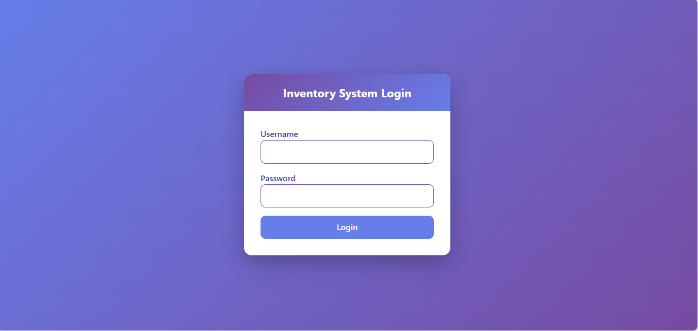

# Inventory Management System

A **web-based Inventory Management System** built with **PHP, MySQL, HTML, CSS (Bootstrap)** and run locally using **XAMPP**.  
The system allows businesses to efficiently manage products, customers, suppliers, and orders with full **CRUD functionality**.

---

## **Features**

- User Authentication with session-based login.
- Dashboard for quick navigation to all modules.
- Products Module: Add, View, Edit, Delete products.
- Customers Module: Add and View customers.
- Suppliers Module: View suppliers.
- Orders Module: Place and View orders.
- Database normalized up to **4NF**.
- Efficient SQL queries using **JOINs**.
- Form validation, error handling, and session management.

---

## **Technologies Used**

- **Backend:** PHP  
- **Database:** MySQL  
- **Frontend:** HTML, CSS, Bootstrap  
- **Local Server:** XAMPP  

---

## **Database**

- **Database Name:** `inventory_db`  
- **Tables:** `products`, `categories`, `customers`, `suppliers`, `orders`, `users`, `vieworders`  
> Import the `inventory_db.sql` file to create the database and tables.
## **ScreenShorts**

## **Installation & Setup**

1. Clone this repository:
   git clone (https://github.com/username/Inventory_management.git)

2. Copy the project folder to your XAMPP `htdocs` directory.

3. Start **Apache** and **MySQL** from XAMPP Control Panel.

4. Import the database:
   * Open **phpMyAdmin**.
   * Create a new database named `inventory_db`.
   * Import `inventory_db.sql`.

5. Open your browser and go to:
   http://localhost/inventory_management/

6. Login with default credentials:
   * **Username:** admin
   * **Password:** admin123

## **Skills Demonstrated**

* PHP & MySQL web development
* CRUD operations and relational database management
* Database normalization (1NF–4NF)
* SQL JOINs and queries
* Frontend design with Bootstrap
* Session management and authentication
* Error handling and form validation
